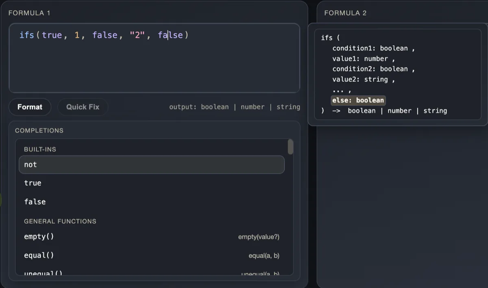

# notion-formula-rs

- **Demo:** https://www.jovers.org/notion-formula-rs
- **Docs:** [Design docs](./docs/design/README.md)
- **Status:**
  - Editor tooling (analyzer + completion/assists) is usable today.
  - Evaluator/runtime execution is the next milestone (host-context contract first).

## What is this?

`notion-formula-rs` is a Rust workspace for **Notion-style formula tooling**.

It targets **editor-facing** use cases: parse, diagnostics, formatting, and IDE-style assists.
It is meant to be embedded in editors/UIs (including browser apps via WASM), not shipped as a standalone product.

You get:

- lexing + parsing to an AST
- diagnostics with stable spans/offsets
- deterministic formatting
- IDE-style assists (completion, signature help, code actions)
- a WASM boundary for browser demos and integrations

## Predictable, compile-time typing (no runtime magic)

The analyzer performs compile-time type inference and produces a deterministic result type.
When possible, we preserve union types instead of collapsing mixed branches to `unknown`.

Example (in my testing):

- In Notion today: `if(true, 1, "2")` → `unknown`
- Here:            `if(true, 1, "2")` → `number | string`

## Editor assists (signature help, completion)

The analyzer also provides IDE-style assists for interactive formula UIs.

Example:

- Signature help for variadic `ifs(...)` shows parameter names/types and a precise return type.
  - `ifs(true, 1, false, "2", false)` → `boolean | number | string`



## What Works Today

- `analyzer/`: parsing + diagnostics + semantic checks
- `ide/`: formatter + completion/signature help + edit ops
- `analyzer_wasm/`: WASM/JS API + TypeScript DTOs
- `examples/vite/`: CodeMirror demo + UI test coverage

## Current Limits

- Evaluator/runtime execution is not implemented yet; it is the next milestone (host-context contract first).
- Language and type coverage are still expanding. Notion Formula compatibility is the default; extensions are additive and opt-in.
- Some areas are tracked as TODOs in design docs while the toolchain stabilizes.

## Prerequisites

- Rust (stable)
- Node.js `>=20`
- pnpm `^10`
- `wasm-pack` (needed when building the WASM demo package)

## Quick Start

Run from repository root.

### 1) Run Rust tests

```bash
# just
just test-analyzer
just test-ide
just test-analyzer_wasm

# manual
cargo test -p analyzer
cargo test -p ide
cargo test -p analyzer_wasm
```

### 2) Run demo tests (unit + E2E)

```bash
# just
just test-example-vite

# manual
cd examples/vite && pnpm -s run wasm:build && pnpm -s run test && pnpm -s run test:e2e
```

### 3) Run the demo app

```bash
# just
pnpm -C examples/vite install   # first time only
just run-example-vite

# manual
cd examples/vite && pnpm -s run wasm:build && pnpm -s run dev
```

Open the URL printed by Vite (usually `http://127.0.0.1:5173`).

### 4) Run the full test suite in one command

```bash
# just
just test
```

## API Surface

There is no end-user CLI compiler here. You normally integrate through Rust APIs or WASM exports.

### Rust (`analyzer`)

```rust
// Lex + parse. Returns AST, tokens, and parse diagnostics.
pub fn analyze_syntax(text: &str) -> SyntaxResult;

// Lex + parse + semantic analysis using your context.
pub fn analyze(text: &str, ctx: &semantic::Context) -> AnalyzeResult;

// Type inference + semantic validation using your context.
pub fn analyze_expr(expr: &ast::Expr, ctx: &semantic::Context) -> (semantic::Ty, Vec<Diagnostic>);

// Infer expression types for subexpressions (used by IDE/signature-help).
pub fn infer_expr_with_map(
    expr: &ast::Expr,
    ctx: &semantic::Context,
    map: &mut TypeMap,
) -> semantic::Ty;

// Deterministic, human-readable diagnostics rendering.
pub fn format_diagnostics(source: &str, diags: Vec<Diagnostic>) -> String;
```

### Rust (`ide`)

```rust
// IDE-facing completion + signature-help shape split.
pub fn help(
    source: &str,
    cursor_byte: usize,
    ctx: &analyzer::semantic::Context,
    config: CompletionConfig,
) -> HelpResult;

// IDE edit operations in byte coordinates.
pub fn format(source: &str, cursor_byte: u32) -> Result<ApplyResult, IdeError>;
pub fn apply_edits(
    source: &str,
    edits: Vec<analyzer::TextEdit>,
    cursor_byte: u32,
) -> Result<ApplyResult, IdeError>;
```

### WASM (`analyzer_wasm`)

```typescript
// wasm-bindgen exports (stateful Analyzer instance).
export class Analyzer {
  constructor(config: AnalyzerConfig);
  analyze(source: string): AnalyzeResult;
  format(source: string, cursorUtf16: number): ApplyResult;
  apply_edits(source: string, edits: TextEdit[], cursorUtf16: number): ApplyResult;
  help(source: string, cursorUtf16: number): HelpResult;
}

// TypeScript wrapper API used by the demo
// (examples/vite/src/analyzer/wasm_client.ts).
export function initWasm(config: AnalyzerConfig): Promise<void>;
export function analyze(source: string): AnalyzeResult;
export function format(source: string, cursorUtf16: number): ApplyResult;
export function apply_edits(
  source: string,
  edits: TextEdit[],
  cursorUtf16: number,
): ApplyResult;
export function help(source: string, cursorUtf16: number): HelpResult;
```

`AnalyzerConfig` rules are strict:

- it must be an object
- unknown top-level fields are rejected
- use `{}` when you have no context to pass
- `preferred_limit` is optional; `null` uses default `5`

Current schema:

```json
{
  "properties": [
    { "name": "Status", "type": "String" },
    { "name": "Score", "type": "Number" }
  ],
  "preferred_limit": 6
}
```

## Important Contracts

These rules are central for integrations:

- In Rust core (`analyzer/`), spans are UTF-8 byte offsets.
- At JS/WASM boundary (`analyzer_wasm/`), spans/offsets are UTF-16 code units.
- Spans are half-open everywhere: `[start, end)`.
- Diagnostics and formatting are designed to be deterministic.

If your editor pipeline depends on coordinates, read the WASM and tokens/spans design docs first.

## Testing

### Rust analyzer tests

```bash
# just
just test-analyzer

# manual
cargo test -p analyzer
```

### Rust IDE tests

```bash
# just
just test-ide

# manual
cargo test -p ide
```

### Rust WASM tests

```bash
# just
just test-analyzer_wasm

# manual
cargo test -p analyzer_wasm
wasm-pack test --node analyzer_wasm
```

### Update golden snapshots

Diagnostics golden (`analyzer`):

```bash
# just
just test-analyzer-bless

# manual
BLESS=1 cargo test -p analyzer
```

Format golden (`ide`):

```bash
# just
just test-ide-bless

# manual
BLESS=1 cargo test -p ide format_golden
```

### Demo unit + E2E tests

```bash
# just
just test-example-vite

# manual
cd examples/vite && pnpm -s run wasm:build && pnpm -s run test && pnpm -s run test:e2e
```

## Common Dev Commands

```bash
# just
just build     # build demo bundle (wasm build + install + vite build)
just check    # cargo check + clippy + frontend checks
just fmt      # rustfmt + frontend format
just fix      # clippy --fix + frontend lint fixes
just gen-ts   # export TS DTO types from analyzer_wasm
just test     # repo test suite
just test-analyzer
just test-ide
just test-analyzer_wasm
just test-analyzer-bless
just test-ide-bless
just test-example-vite
just run-example-vite  # build wasm and start demo dev server
```

## Repository Layout

| Path | Role |
|---|---|
| `analyzer/` | Core analyzer logic: lexer/parser/AST/diagnostics/semantic |
| `ide/` | IDE/editor helpers: format/completion/help/edit-apply |
| `analyzer_wasm/` | WASM boundary, UTF-16<->UTF-8 conversions, DTO serialization |
| `evaluator/` | Runtime evaluator TODO (coming soon) |
| `examples/vite/` | Browser demo (CodeMirror + WASM integration) |
| `docs/` | Contracts, architecture docs, deep dives, and changelog guidance |

## Documentation Map

If you only read three docs, read these first:

1. [`docs/design/README.md`](docs/design/README.md) (stable architecture + contracts)
2. [`analyzer/README.md`](analyzer/README.md) (current analyzer behavior and module map)
3. [`ide/README.md`](ide/README.md) (IDE helper surface and contracts)

More focused docs:

- [`docs/design/completion.md`](docs/design/completion.md)
- [`docs/design/tokens-spans.md`](docs/design/tokens-spans.md)
- [`docs/design/wasm-boundary.md`](docs/design/wasm-boundary.md)
- [`examples/vite/README.md`](examples/vite/README.md)

## Contributing

Thank you for your interest in contributing to `notion-formula-rs`.
There are many ways to contribute, and we appreciate all of them.

Documentation for contributing to the analyzer, WASM layer, and demo tooling is in the
[Guide to notion-formula-rs Development](docs/README.md).

When behavior or contracts change:

- update the relevant module README/docs in place
- add or update tests
- call out contract changes clearly in the PR description

## License

Apache-2.0. See `LICENSE`.
