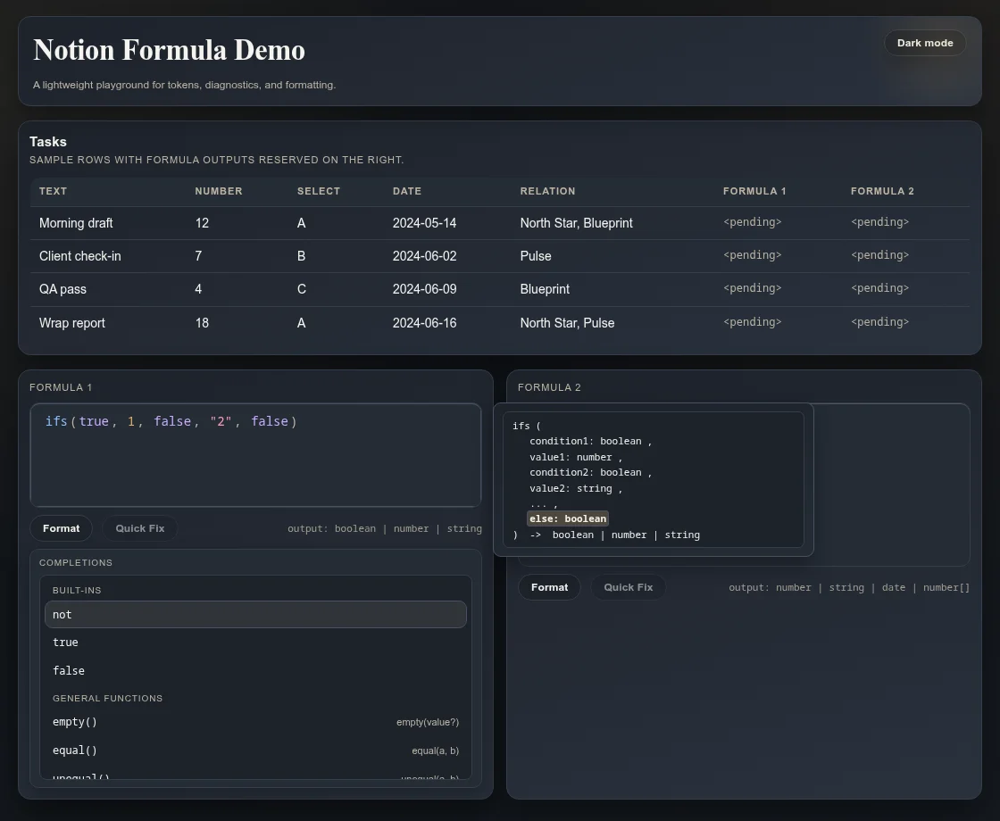

# notion-formula-rs

A Rust Formula engine for analyzing, editing, and evaluating Notion-style formulas.

[Live demo](https://joverzhang.github.io/notion-formula-rs/) ·
[Documentation](docs/README.md) · [简体中文](README.zh-CN.md)

## What it does

- Analyzes incomplete formula source and returns diagnostics and inferred result types.
- Provides completion, signature help, deterministic formatting, and quick fixes for formula
  editors.
- Evaluates formulas over batches of rows synchronously in Rust.
- Exposes analysis and editor operations to browser integrations through WebAssembly.

## Current scope

The project starts from Notion-style formula syntax but does not promise complete compatibility.
The browser demo focuses on analysis and editing; synchronous row evaluation is currently provided
by the Rust evaluator rather than the demo. The
[current specifications](docs/specs/README.md) define the supported syntax and behavior.

## Explore the project

[Project intent](docs/intent/README.md) · [Current specifications](docs/specs/README.md) ·
[Implementation map](docs/how/README.md)

## License

Licensed under the [Apache License 2.0](LICENSE).
