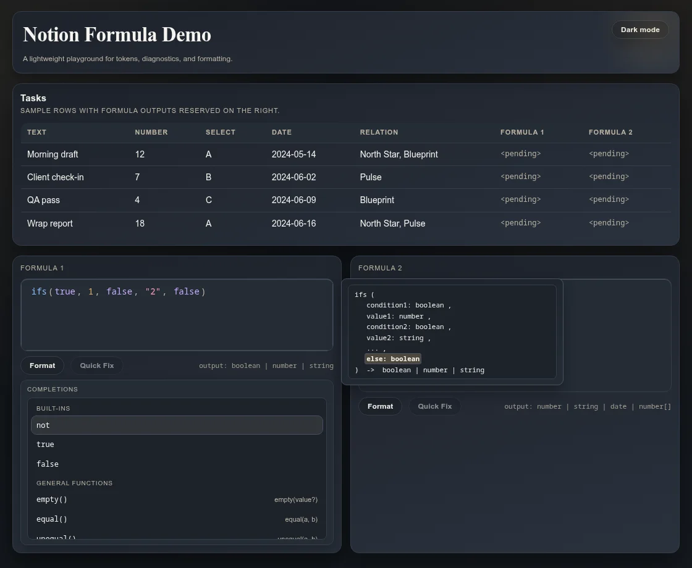

# notion-formula-rs

一个用 Rust 实现的 Formula 引擎，用于分析、编辑和求值 Notion 风格公式。

- [在线演示](https://joverzhang.github.io/notion-formula-rs/)
- [项目文档](docs/README.zh-CN.md)
- [English](README.md)

## 它能做什么

- 在 Formula 尚未写完时继续分析，并返回诊断和推断出的结果类型。
- 为 Formula 编辑器提供补全、签名帮助、确定性格式化和 quick fix。
- 成批计算已保存的 Formula 及其共享依赖。
- 通过 WebAssembly 和 Worker 向浏览器集成提供 Engine 与 Draft 操作。

## 当前范围

项目以 Notion 风格的 Formula 语法为起点，但不承诺完整兼容 Notion。浏览器演示分析正在编辑的 Draft，
并显示已保存定义的批量计算结果。Save 将 Draft 保存到 Engine；Discard 恢复已保存的表达式。受支持的语法和行为以
[当前规格](docs/specs/README.zh-CN.md)为准。

## 继续了解

- [项目意图](docs/intent/README.zh-CN.md)
- [当前规格](docs/specs/README.zh-CN.md)

## License

本项目采用 [Apache License 2.0](LICENSE)。
